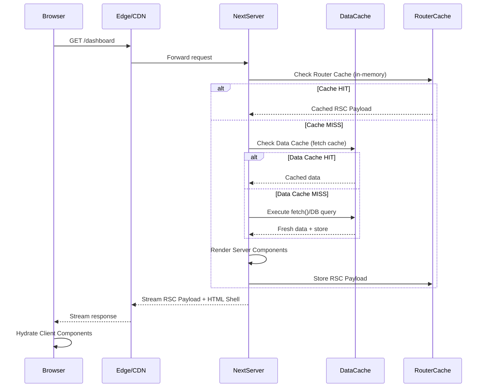
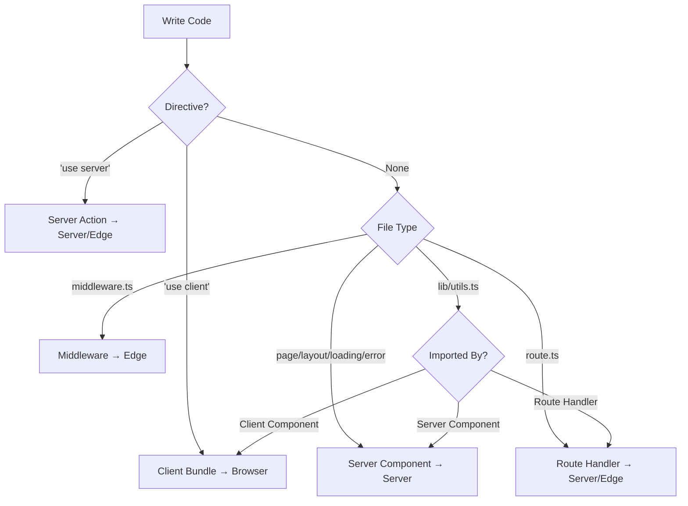

# Next.js Architecture & Mental Model

> **Module**: 1.1 | **Phase**: Foundations | **Prerequisites**: TS, React, HTML, CSS, Git, Terminal

---

## 1. How Next.js Compiles & Serves Your App

### The Build Pipeline (Next.js 14+ with Turbopack)

```mermaid
flowchart LR
    A[Source Code\n.tsx/.ts/.css] --> B[Turbopack\n(Rust-based bundler)]
    B --> C{Build Output}
    C --> D[Server Bundle\n.node/.js]
    C --> E[Client Bundle\n.js/.css]
    C --> F[Static Assets\nHTML/CSS/Images]
    C --> G[Edge Middleware\n.js]
    
    D --> H[Node.js Server\nor Serverless]
    E --> I[Browser]
    F --> J[CDN / Static Hosting]
    G --> K[Edge Runtime\n(Vercel/Cloudflare)]
```

### Key Compilation Concepts

| Concept | Description |
|---------|-------------|
| **Turbopack** | Rust-based bundler (successor to Webpack), incremental by default |
| **Server Components** | Compiled to server-only bundle, never sent to client |
| **Client Components** | Compiled to browser bundle, hydrated on client |
| **Shared Components** | Can be imported by both, but execute in their importer's context |
| **Edge Runtime** | Subset of Node.js APIs, runs on CDN edge nodes |

---

## 2. App Router Mental Model: Server Components by Default

### The Fundamental Shift

```
┌─────────────────────────────────────────────────────────────┐
│                    NEXT.JS 13+ APP ROUTER                   │
├─────────────────────────────────────────────────────────────┤
│  📁 app/                                                    │
│  ├── layout.tsx          ← Server Component (default)       │
│  ├── page.tsx            ← Server Component (default)       │
│  ├── loading.tsx         ← Server Component                 │
│  ├── error.tsx           ← Server Component                 │
│  ├── not-found.tsx       ← Server Component                 │
│  ├── components/                                                   
│  │   ├── ServerComp.tsx  ← Server Component (default)       │
│  │   └── ClientComp.tsx  ← 'use client' directive           │
│  └── api/                ← Route Handlers (Server only)     │
└─────────────────────────────────────────────────────────────┘
```

### Server Component Rules (Memorize These)

1. **Default = Server Component** — No directive needed
2. **`'use client'`** — Opt-in to Client Component (browser bundle)
3. **`'use server'`** — Server Actions (mutations, forms)
4. **No mixing** — A file is either Server OR Client, not both
5. **Composition > Inheritance** — Pass Client Components as children to Server Components

```tsx
// app/page.tsx — Server Component (default)
import { ClientCounter } from './components/ClientCounter';
import { ServerOnlyData } from './lib/data';

export default async function Page() {
  // ✅ Runs on SERVER at request time (or build time)
  const data = await ServerOnlyData.fetch(); // DB, FS, secrets OK
  
  return (
    <main>
      <h1>Server Rendered: {data.title}</h1>
      {/* ✅ Client Component as child — boundary preserved */}
      <ClientCounter initialCount={data.count} />
    </main>
  );
}
```

```tsx
// app/components/ClientCounter.tsx — Client Component
'use client';

import { useState } from 'react';

export function ClientCounter({ initialCount = 0 }: { initialCount: number }) {
  const [count, setCount] = useState(initialCount);
  
  // ✅ Browser APIs, hooks, event handlers OK here
  return <button onClick={() => setCount(c => c + 1)}>Count: {count}</button>;
}
```

---

## 3. Request → Response Lifecycle (Next.js 14+)

### Complete Request Flow



### Three Rendering Strategies

| Strategy | When | Use Case |
|----------|------|----------|
| **Static (SSG)** | Build time | Marketing pages, blogs, docs |
| **Dynamic (SSR)** | Request time | Dashboards, user-specific data |
| **Streaming** | Request time (chunked) | Slow data dependencies, progressive UI |

```tsx
// app/dashboard/page.tsx — Dynamic by default (uses cookies/headers)
export default async function Dashboard() {
  const session = await auth(); // Dynamic: reads cookies
  const data = await fetchData(session.userId); // Dynamic: user-specific
  return <DashboardView data={data} />;
}

// Force static: export const dynamic = 'force-static'
// Force dynamic: export const dynamic = 'force-dynamic' (default)
// Revalidate: export const revalidate = 60 // ISR every 60s
```

---

## 4. The Three Caches (Critical Mental Model)

### Cache Hierarchy

```
┌────────────────────────────────────────────────────────────────┐
│                        REQUEST                                   │
└──────────────────────────┬─────────────────────────────────────┘
                           ▼
┌────────────────────────────────────────────────────────────────┐
│  1. ROUTER CACHE (In-Memory, Per-Session)                      │
│     • Stores: RSC Payload (serialized React tree)              │
│     • Key: Route + Search Params                               │
│     • Lifetime: Session / Navigation                           │
│     • Invalidated by: router.refresh(), revalidatePath()       │
└──────────────────────────┬─────────────────────────────────────┘
                           ▼
┌────────────────────────────────────────────────────────────────┐
│  2. DATA CACHE (Persistent, Cross-Request)                     │
│     • Stores: fetch() responses, unstable_cache() results      │
│     • Key: fetch URL + options (or cache key)                  │
│     • Lifetime: Until revalidate / manual invalidation         │
│     • Backend: File system (dev) / Redis/DB (prod)             │
└──────────────────────────┬─────────────────────────────────────┘
                           ▼
┌────────────────────────────────────────────────────────────────┐
│  3. FULL ROUTE CACHE (Static HTML + RSC Payload)               │
│     • Stores: Pre-rendered HTML + RSC Payload for static routes│
│     • Generated at: Build time (or ISR revalidation)           │
│     • Served from: CDN / Edge                                  │
│     • Only for: Fully static routes (no dynamic APIs)          │
└────────────────────────────────────────────────────────────────┘
```

### Cache Control Cheatsheet

```tsx
// 1. fetch() cache control (Data Cache)
fetch(url, { 
  cache: 'force-cache' | 'no-store' | 'no-cache' | 'only-if-cached',
  next: { 
    revalidate: 60 | false,      // seconds or false = no revalidate
    tags: ['posts', 'user-123']  // for revalidateTag()
  }
});

// 2. unstable_cache() — Cache any async function (Data Cache)
import { unstable_cache } from 'next/cache';

const getUser = unstable_cache(
  async (id: string) => db.user.find(id),
  ['user-detail'],           // cache key parts
  { revalidate: 3600, tags: ['user'] }
);

// 3. Router Cache invalidation
import { revalidatePath, revalidateTag } from 'next/cache';

revalidatePath('/dashboard');      // Invalidate Router + Data Cache for path
revalidateTag('posts');            // Invalidate all fetch() with tag 'posts'

// 4. Force dynamic rendering (opts out of Full Route Cache)
export const dynamic = 'force-dynamic';
export const dynamicParams = true; // For generateStaticParams
```

---

## 5. When Code Runs: Build vs Request vs Edge

### Execution Context Matrix

| Code Location | Build Time | Request Time (Server) | Request Time (Edge) | Browser |
|---------------|------------|----------------------|---------------------|---------|
| `app/**/page.tsx` (static) | ✅ HTML + RSC | ❌ | ❌ | Hydration |
| `app/**/page.tsx` (dynamic) | ❌ | ✅ RSC Payload | ❌* | Hydration |
| `app/**/route.ts` | ❌ | ✅ Handler | ✅ Handler | ❌ |
| `middleware.ts` | ❌ | ❌ | ✅ | ❌ |
| `'use client'` components | ❌ Bundle | ❌ | ❌ | ✅ Render |
| `generateStaticParams` | ✅ | ❌ | ❌ | ❌ |
| `generateMetadata` | ✅ (static) | ✅ (dynamic) | ❌ | ❌ |

*Edge runtime for pages: `export const runtime = 'edge'` (limited Node APIs)

### Code Execution Examples

```tsx
// app/products/page.tsx
import { getProducts } from '@/lib/db';

// 1. BUILD TIME — generateStaticParams
export async function generateStaticParams() {
  const products = await getProducts(); // Runs at BUILD
  return products.map(p => ({ slug: p.slug }));
}

// 2. REQUEST TIME (Server) — Page component
export default async function Page({ params }: { params: { slug: string } }) {
  // Runs on EVERY REQUEST (dynamic) or cached (static)
  const product = await getProduct(params.slug); 
  return <ProductView product={product} />;
}

// 3. REQUEST TIME (Edge) — Middleware
// middleware.ts
export function middleware(request: NextRequest) {
  // Runs on EDGE for every request
  if (!request.cookies.has('auth')) {
    return NextResponse.redirect(new URL('/login', request.url));
  }
}
export const config = { matcher: '/dashboard/:path*' };
```

---

## 6. Mental Model: "Where Does This Code Execute?"

### Decision Flowchart



### Practical Rules of Thumb

| Scenario | Where It Runs | How to Think About It |
|----------|---------------|----------------------|
| `fetch()` in page.tsx | Server (Request or Build) | "Database query at render time" |
| `useState` in ClientComp | Browser | "Interactive UI state" |
| `cookies()` / `headers()` | Server (Request) | "Request context, forces dynamic" |
| `fs.readFile` / `process.env` | Server (Build or Request) | "Server-only secrets/FS" |
| `window` / `localStorage` | Browser only | "Guard with `useEffect` or `'use client'`" |
| `next/navigation` hooks | Browser | "Client-side routing only" |

---

## 7. Mini-Project: Scaffold Your Learning Repo

### Initialize the Project

```bash
# Create project with App Router, TypeScript, Tailwind, ESLint
npx create-next-app@latest nextjs-course --typescript --tailwind --eslint --app --src-dir --import-alias "@/*" --use-npm

cd nextjs-course
npm run dev
```

### Project Structure to Create

```
nextjs-course/
├── src/
│   ├── app/
│   │   ├── layout.tsx          # Root layout (Server)
│   │   ├── page.tsx            # Home page (Server)
│   │   ├── dashboard/
│   │   │   ├── page.tsx        # Dynamic page (Server)
│   │   │   └── loading.tsx     # Streaming fallback
│   │   ├── products/
│   │   │   ├── page.tsx        # Static list (SSG)
│   │   │   └── [slug]/
│   │   │       └── page.tsx    # Dynamic params (SSG + ISR)
│   │   └── api/
│   │       └── products/
│   │           └── route.ts    # API route (Server)
│   ├── components/
│   │   ├── ui/                 # Shared UI primitives
│   │   ├── ProductCard.tsx     # Server Component
│   │   └── ThemeToggle.tsx     # Client Component ('use client')
│   ├── lib/
│   │   ├── db.ts               # Mock data / DB client
│   │   ├── cache.ts            # unstable_cache helpers
│   │   └── auth.ts             # Mock auth (cookies)
│   └── types/
│       └── index.ts            # Shared types
├── middleware.ts               # Edge middleware
├── next.config.js
└── package.json
```

### Starter Code: `src/lib/db.ts` (Mock Data Layer)

```ts
// src/lib/db.ts
export interface Product {
  id: string;
  slug: string;
  name: string;
  price: number;
  description: string;
}

const products: Product[] = [
  { id: '1', slug: 'react-essentials', name: 'React Essentials', price: 49, description: 'Master React fundamentals' },
  { id: '2', slug: 'nextjs-mastery', name: 'Next.js Mastery', price: 79, description: 'Full-stack Next.js' },
  { id: '3', slug: 'typescript-pro', name: 'TypeScript Pro', price: 59, description: 'Advanced TS patterns' },
];

export async function getProducts(): Promise<Product[]> {
  // Simulate DB latency
  await new Promise(r => setTimeout(r, 100));
  return products;
}

export async function getProduct(slug: string): Promise<Product | null> {
  await new Promise(r => setTimeout(r, 50));
  return products.find(p => p.slug === slug) ?? null;
}
```

### Starter Code: `src/app/products/page.tsx` (Static Generation)

```tsx
// src/app/products/page.tsx
import { getProducts } from '@/lib/db';
import { ProductCard } from '@/components/ProductCard';
import { Metadata } from 'next';

export const metadata: Metadata = {
  title: 'Products | NextJS Course',
  description: 'Browse our course catalog',
};

export async function generateStaticParams() {
  const products = await getProducts();
  return products.map(p => ({ slug: p.slug }));
}

export default async function ProductsPage() {
  const products = await getProducts(); // Cached by Data Cache
  
  return (
    <div className="container mx-auto py-12 px-4">
      <h1 className="text-4xl font-bold mb-8">Course Catalog</h1>
      <div className="grid gap-6 md:grid-cols-2 lg:grid-cols-3">
        {products.map(product => (
          <ProductCard key={product.id} product={product} />
        ))}
      </div>
    </div>
  );
}
```

### Starter Code: `src/components/ProductCard.tsx` (Server Component)

```tsx
// src/components/ProductCard.tsx
import Link from 'next/link';
import { Product } from '@/lib/db';

interface ProductCardProps {
  product: Product;
}

// No 'use client' = Server Component
export function ProductCard({ product }: ProductCardProps) {
  return (
    <article className="border rounded-lg p-6 shadow-sm hover:shadow-md transition-shadow">
      <h2 className="text-xl font-semibold mb-2">{product.name}</h2>
      <p className="text-gray-600 mb-4 line-clamp-2">{product.description}</p>
      <div className="flex items-center justify-between">
        <span className="text-2xl font-bold text-primary-600">${product.price}</span>
        <Link 
          href={`/products/${product.slug}`}
          className="text-primary-600 hover:underline text-sm font-medium"
        >
          View Details →
        </Link>
      </div>
    </article>
  );
}
```

### Starter Code: `src/components/ThemeToggle.tsx` (Client Component)

```tsx
// src/components/ThemeToggle.tsx
'use client';

import { useEffect, useState } from 'react';

export function ThemeToggle() {
  const [theme, setTheme] = useState<'light' | 'dark'>('light');
  const [mounted, setMounted] = useState(false);

  useEffect(() => {
    setMounted(true);
    const saved = localStorage.getItem('theme') as 'light' | 'dark' | null;
    if (saved) setTheme(saved);
    else if (window.matchMedia('(prefers-color-scheme: dark)').matches) setTheme('dark');
  }, []);

  useEffect(() => {
    if (!mounted) return;
    document.documentElement.classList.toggle('dark', theme === 'dark');
    localStorage.setItem('theme', theme);
  }, [theme, mounted]);

  if (!mounted) return <div className="w-10 h-10" />; // Prevent layout shift

  return (
    <button
      onClick={() => setTheme(t => t === 'light' ? 'dark' : 'light')}
      className="p-2 rounded-lg bg-gray-100 dark:bg-gray-800"
      aria-label="Toggle theme"
    >
      {theme === 'light' ? '🌙' : '☀️'}
    </button>
  );
}
```

---

## 8. Exercises & Verification

### Exercise 1: Identify Execution Context
For each file below, mark where the code executes: **Build / Server Request / Edge / Browser**

| File | Code Snippet | Execution Context |
|------|--------------|-------------------|
| `app/page.tsx` | `const data = await fetch(...)` | |
| `components/Button.tsx` | `const [count, setCount] = useState(0)` | |
| `middleware.ts` | `return NextResponse.redirect(...)` | |
| `app/api/users/route.ts` | `return Response.json(users)` | |
| `lib/utils.ts` | `export function formatDate(d) {...}` (imported by page.tsx) | |
| `app/products/[slug]/page.tsx` | `generateStaticParams()` | |

### Exercise 2: Cache Invalidation
You have a `/dashboard` page that shows user-specific data fetched via `fetch('/api/user', { next: { tags: ['user'] } })`. The user updates their profile via a Server Action. What cache invalidation calls do you need?

### Exercise 3: Composition Pattern
Refactor this anti-pattern into proper Server/Client composition:

```tsx
// ❌ Anti-pattern: Server Component trying to use browser API
export default function Page() {
  const theme = localStorage.getItem('theme'); // ERROR!
  return <div className={theme}>...</div>;
}
```

---

## 9. Key Takeaways

1. **Default = Server Component** — Embrace it. Move client interactivity to leaf components.
2. **Three Caches** — Router (navigation), Data (fetch), Full Route (static HTML). Know which you're hitting.
3. **Dynamic vs Static** — `cookies()`, `headers()`, `searchParams` force dynamic. `generateStaticParams` enables static.
4. **Composition over directives** — Pass Client Components as children to Server Components.
5. **Edge vs Node** — Middleware = Edge. Pages = Node (unless `runtime = 'edge'`).

---

## 10. Next Module Preview

**Module 1.2: Routing & Navigation Deep Dive**
- File-based routing: segments, dynamic routes, route groups
- Layout hierarchy & nested layouts
- `loading.tsx`, `error.tsx`, `not-found.tsx` boundaries
- Parallel routes & intercepting routes
- Programmatic navigation: `useRouter`, `usePathname`, `useSearchParams`
- Route handlers (API routes) vs Server Actions

---

## References & Further Reading

- [Next.js App Router Docs](https://nextjs.org/docs/app)
- [Server Components RFC](https://github.com/reactjs/rfcs/blob/main/text/0188-server-components.md)
- [Next.js Caching Deep Dive](https://nextjs.org/docs/app/building-your-application/caching)
- [Turbopack Architecture](https://turbo.build/pack/docs)
